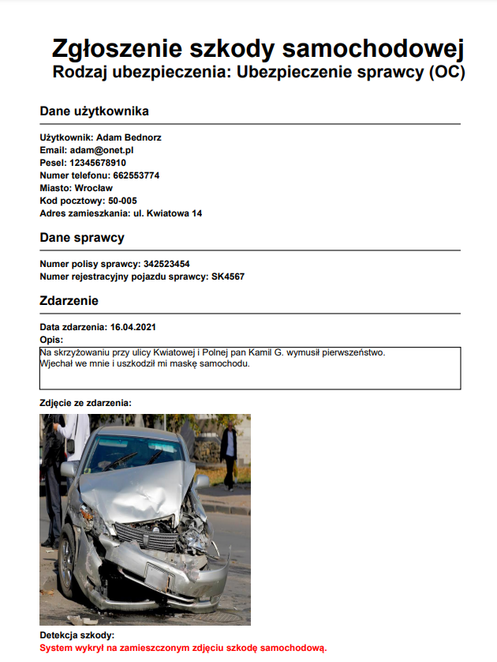

# Web-based app providing automation to insurance claims validation

The project and the prototype of a web-based app providing automation to insurance claims validation. The application allows you to handle information about ongoing car insurance. The user can add new policies to the system and edit the added policies. The app allows you to report car damage with appropriate photo documentation, from your insurance or the guilty party’s insurance. Additionally, the web application contains mechanisms enabling the detection of car damages on attached accident photos. After reporting the damage, the user can generate a pdf document summarizing the entire accident with the most important information about the accident and the damage detection information.

Build with client-server architecture:

- Server - ASP.NET Core
- Gui - React
- Mechanism of car damage detection - Azure Cognitive Services

Because of application was created with rules of reporting damages in Poland, the user interfaces and generated documents are in **polish language**.

## Mechanism of car damage detection

Using Azure Custom Vision service available by Azure Cognitive Services, the model was created for detection car damge. Dataset for training has 652 photos with car damages. The test dataset has 131 photos. The created model has a precision of 84.7%.

## User interface

## Summary document

